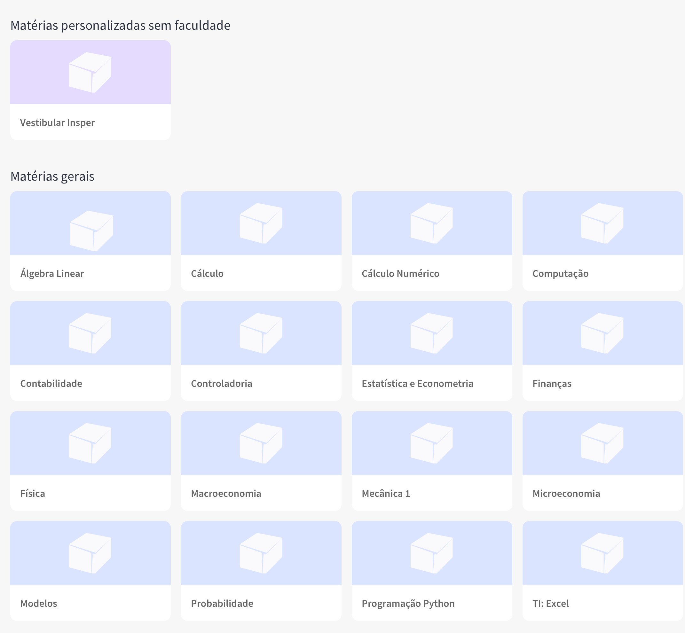

Desafio de recrutamento de front-end
====================================
Este repositório contém o desafio de recrutamento para a vaga de front-end da Estudar com Você.

# Para entrar na aplicação: 
* Acesse: https://goofy-ritchie-4f3cb7.netlify.com/
* A aplicação mostra todas as disciplinas que o usuário possui, dividindo-as entre *gerais* e *personalizadas*
* É possível filtrar para aparecer somente as gerais ou personalizadas.

# Para executar o código localmente:
* É necessário ter instalado o node.js e o react
* Após instalado dar *npm start* no console, dentro da pasta da aplicação. Em instantes a página irá abrir. 

## Considerações
Essa aplicação utiliza:
* React 
    * Redux
    * Router
* Bootstrap

---
## Requisitos com divisão de atividades
Objetivo: implementar um mockup da dashboard do site da Estudar com Você.

* [x] Listar as matérias separando-as entre personalizadas e gerais.
* [x] Responder bem a diferentes tamanhos de tela.
* [x] Incluir alguma funcionalidade extra.   
    * [x] Filtro com opção para visualizar todas as matérias, apenas gerais, apenas personalizadas.
* [x] Readme deve conter instruções de como executar o código. 

---

## Descrição do desafio

Seu objetivo será implementar um mockup da dashboard do nosso site.

A dashboard é a nossa pagina principal, para o qual o aluno é levado após o login. Nela apresentamos todas as matérias para o aluno e ele pode explorar as matérias que oferecemos para a sua faculdade, e a partir dela chegar ao conteúdo que ele deseja estudar. Se você já usou algum site de cursos online (eg. *Coursera, Khan Academy, Duolingo...*) ou serviços de vídeo como *YouTube* ou *Netflix* você pode estar familiarizado com a função que a dashboard desempenha.

## Detalhes

Sua missão será criar um mockup da listagem de matérias, separadas entre matérias personalizadas (matérias que criamos para faculdades especificas), e matérias gerais. Uma matéria gerais é definido pela flag `generic`, se esta flag for `true` a matéria é geral, caso contrário ela é personalizada.

Não se preocupe em reproduzir o design da nossa tela, ele está incluído apenas como inspiração, o que iremos analisar é como você parte de dados e cria uma tela a partir disso

Você tem total liberdade para decidir qual stack / tecnologias irá utilizar, deixamos apenas como sugestão o que gostamos de usar:
- React
- Bootstrap
- SASS
- Typescript
- Webpack

Estamos fornecendo na pasta `assets` um json contendo uma lista de matérias.

## Critérios de avaliação

A sua solução será avaliada segundo os seguintes critérios

- Funcionalidade
- Qualidade do código (organização, legibilidade, modularidade, controle de versão...)
- Prazo (não estamos definindo um prazo no qual o desfio deve ser concluído, a solução que o candidato julgar como final e o tempo necessário para se chegar a ela serão critérios de avaliação)

Definimos também critérios que não são absolutamente necessários mas valem pontos extras:

- Responder bem a diferentes tamanhos de tela
- Incluir alguma funcionalidade extra

## Entregáveis

A solução deve ser entregue na forma de um link para o repositório hospedando o seu código, o readme deve conter instruções de como executá-lo

---
Qualquer duvida entre em contato conosco.  
Boa Sorte!  
Equipe Estudar com Você